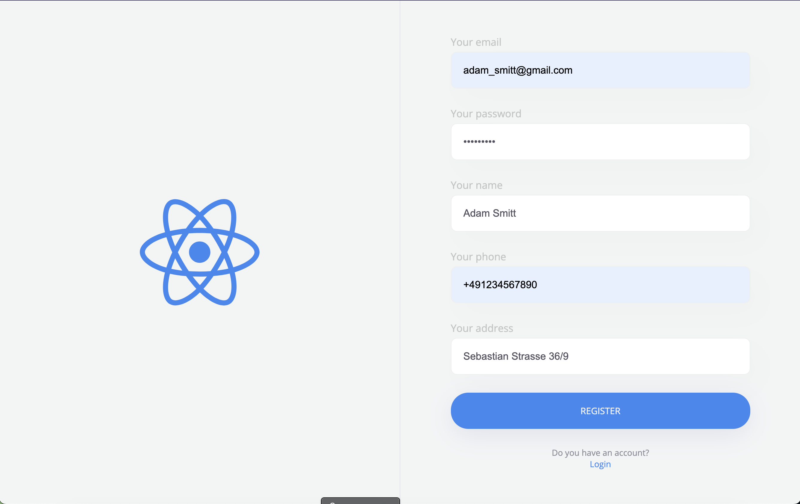
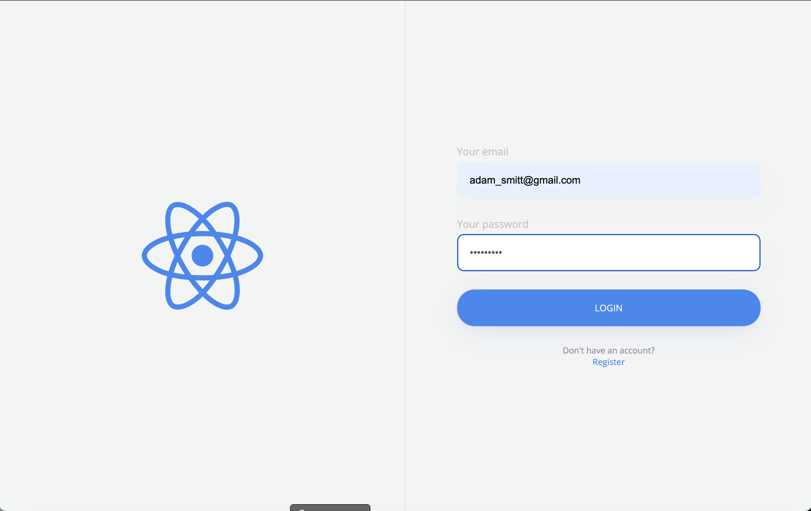
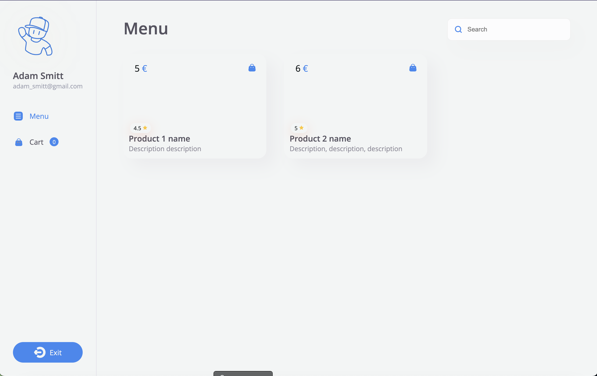
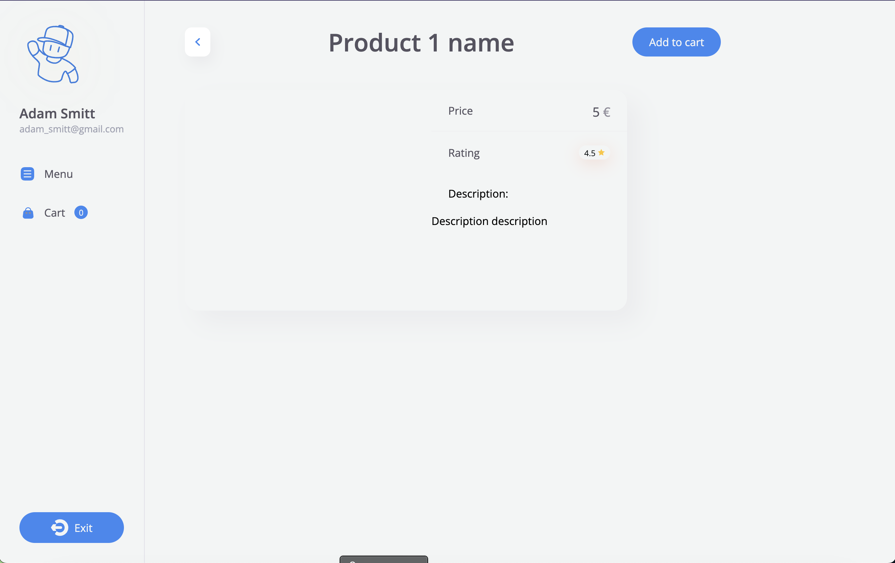
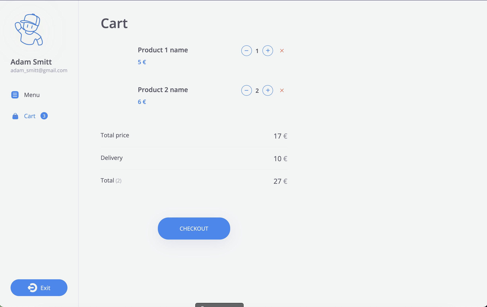
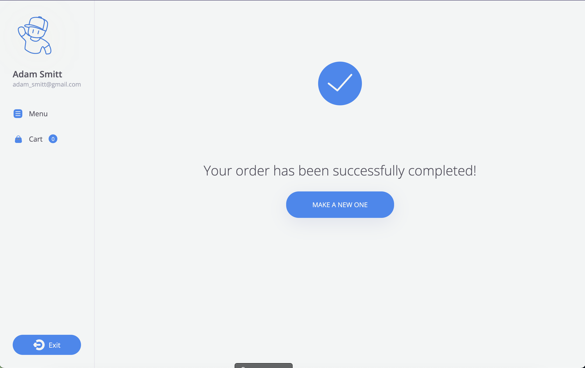

<h1>Negozio</h1>

Backend: <strong>Java + Spring Boot + Spring Security</strong> (using JWT-token)

Frontend: <strong>Vite + React + React Router + Redux Toolkit</strong>

Database: <strong>Postgres</strong>

For a quick start, use the <code>docker-compose up</code> command in terminal
and get URL <code>localhost:8080</code> in browser. Also you can see REST API Documentation in URL: 
<code>localhost:8081/swagger-ui/index.html</code>

In file [negozio.postman_collection.json](demo%2Fnegozio.postman_collection.json)blockchain-banking.postman_collection.jsoncode you can see simple REST API requests for example.
Import this into your Postman =)

